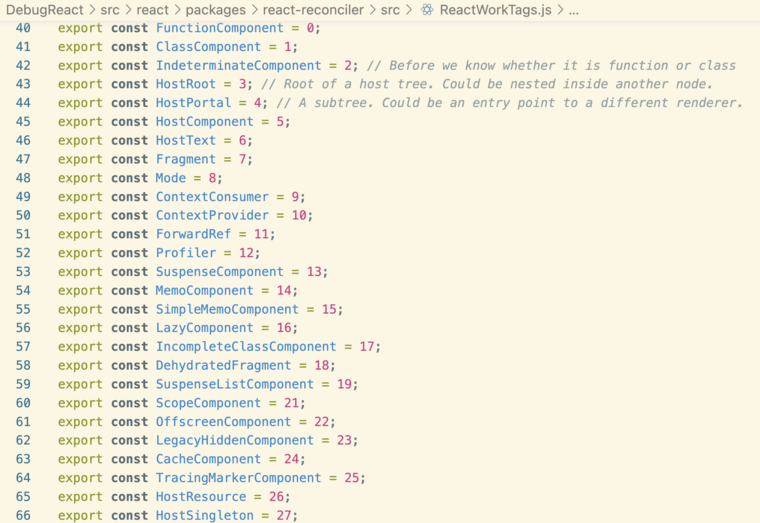

# 类组件生命周期，为什么要废除旧的3个生命周期

图片：[https://projects.wojtekmaj.pl/react-lifecycle-methods-diagram/](https://projects.wojtekmaj.pl/react-lifecycle-methods-diagram/)

_UNSAFE\_componentWillMount_

_UNSAFE\_componentWillUpdate_

_UNSAFE\_componentWillReceiveProps_

stack reconciler → fiber reconciler

从16.3开始，这三个生命周期将不再被推荐使用，因为在随着React架构的迭代，组件的更新时间将不再确定，并且可能会被打断、中止，那么“将要挂载、更新、接收参数这些事情”，都将变得不再可靠 。因此，这些生命周期都成为了UNSAFE\_，不再建议使用。
